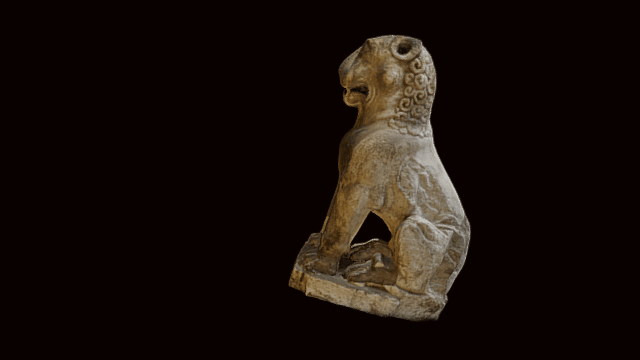

 

# A 3D model of a Guardian Lion from Amaravati stupa

3D data for recreation of a British Museum object.

A guardian lion carved in limestone (‘Palnad marble’), mounted originally seated upright on the vedika railing at the one of the entrances to the pradakshinapatha. 2nd century BC.

This sculpture was doubtless the model used for the illustration seen opp. p. 166 in ‘Indian Fairy Tales’, selected and edited by Joseph Jacobs with illustrations by John D Batten and published by David Nutt in 1892.
Height: 105 centimetres Width: 32.5 centimetres Length: 60 centimetres (side)

COL: RRI1255

Model by Daniel Pett, produced from 297 photographs taken in gallery using a Sony A6000 and assembled in Photoscan Pro.

# LICENSE
The contents of this repository are licensed under CC-BY-NC-SA

# Credits
Photographs and models by Daniel Pett <dpett@britishmuseum.org>, Digital Humanities Lead, British Museum
Copyright Trustees of the British Museum
